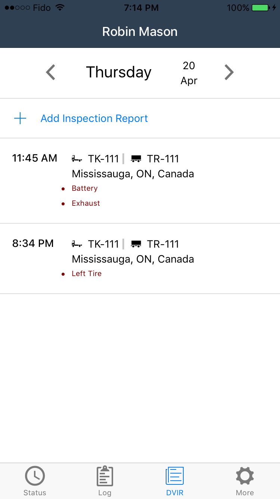

# Introduction

- An electronic logging device (ELD) is a specialized hours tracker required by law for truck drivers driving in the US as part of US Department of Transport (DOT) regulations
- Our solution is one of the 50 software solutions certified by the DOT
- I was responsible for most of the UI design that is still used today, as well as contributed significantly to the frontend and backend codebase of the application
- Now used by over 3000 truck drivers daily

[Android](https://play.google.com/store/apps/details?id=com.trackensure.eld)
[iOS](https://apps.apple.com/ca/app/trackensure-eld/id1269259375)

# Screenshots

  
  

  
  

  
  

  

